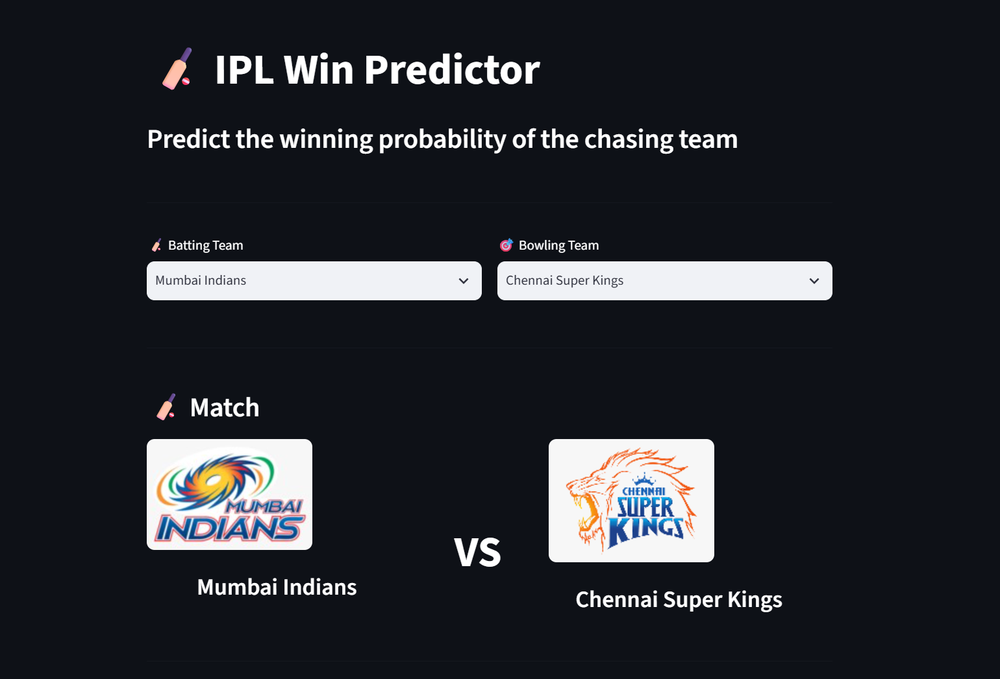
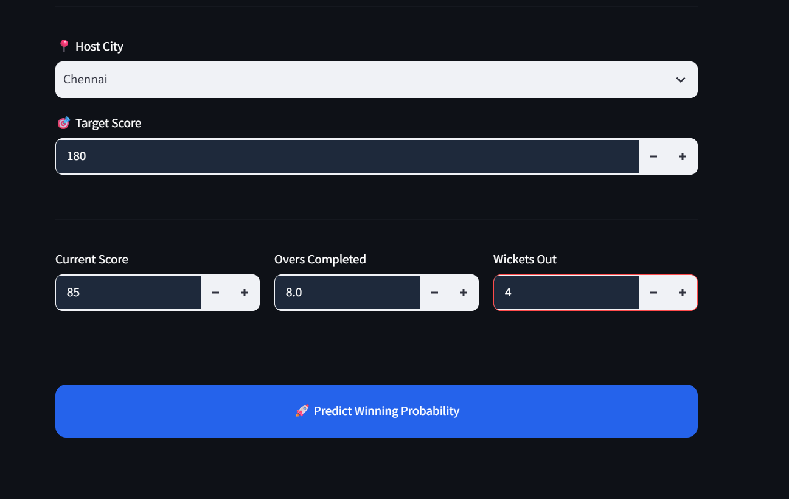
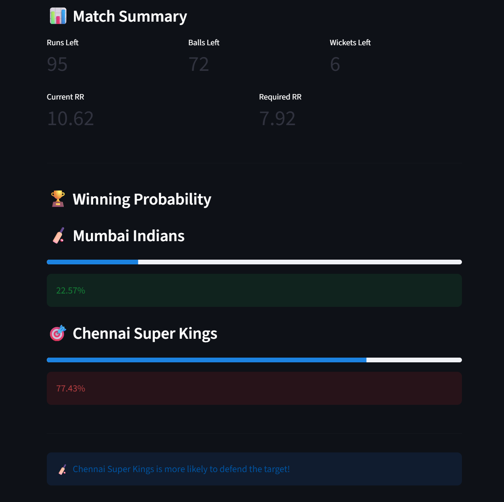

# 🏏 IPL Win Predictor

An end-to-end **Machine Learning** web application that predicts the probability of the chasing team winning an IPL match in real time using **Logistic Regression** and **Streamlit**.

---

## 📌 Features

- 🎯 Real-time win probability prediction
- 📊 Interactive and user-friendly Streamlit interface
- 🏏 Team logo display
- 📈 Current Run Rate (CRR) calculation
- ⚡ Required Run Rate (RRR) calculation
- 📋 Live match summary
- ✅ Input validation for realistic predictions
- 🎉 Prediction visualization with progress bars and animations

---

## 🛠️ Tech Stack

- Python
- Pandas
- NumPy
- Scikit-learn
- Streamlit

---

## 🧠 Machine Learning Model

- **Algorithm:** Logistic Regression
- **Problem Type:** Binary Classification
- **Training Data:**
  - IPL Matches Dataset
  - IPL Deliveries Dataset

The model predicts the probability of the batting team winning based on the current match situation.

---

## 📂 Project Structure

```text
IPL-Win-Predictor/
│
├── app.py
├── pipe.pkl
├── delivery_df.pkl
├── deliveries.csv
├── matches.csv
├── assets/
│   └── logos/
├── README.md
└── .gitignore
```

---

## 🚀 Installation

Clone the repository

```bash
git clone https://github.com/YOUR_USERNAME/IPL-Win-Predictor.git
```

Move into the project folder

```bash
cd IPL-Win-Predictor
```

Install the required libraries

```bash
pip install -r requirements.txt
```

Run the Streamlit application

```bash
streamlit run app.py
```

---

## 📊 Dataset

This project uses two IPL datasets:

- `matches.csv`
- `deliveries.csv`

These datasets contain historical IPL match information used for training and prediction.

---

## 📸 Application Preview

### 🏏 Team Selection

<p align="center">
  
</p>

---

### 📝 Match Input Details

<p align="center">
  
</p>

---

### 🎯 Prediction Result

<p align="center">
  
</p>

## 🔮 Future Improvements

- Support for all IPL seasons
- Improved prediction model (XGBoost / Random Forest)
- Live score integration using APIs
- Player statistics
- Match history dashboard
- Dark mode support

---

## 👨‍💻 Author

**Pavan G**

Computer Science Undergraduate passionate about Machine Learning, Artificial Intelligence, and Software Development.

---

⭐ If you found this project interesting, consider giving it a star!